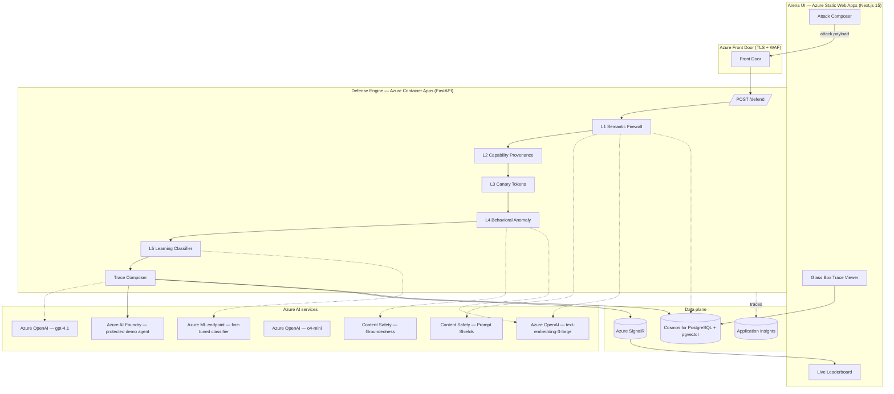

# ARCHITECTURE

## One-paragraph summary

TripWire is an Azure-native HTTP middleware that sits between any agentic application and its LLM/tool calls. Every request flows through a 5-layer defense pipeline. Each layer's verdict and reasoning is captured in an immutable trace stored in Cosmos for Postgres with pgvector. A Next.js arena UI lets users (and judges) attempt attacks against a protected demo agent; results stream to a real-time leaderboard via Azure SignalR; the Glass Box renders the per-layer trace with a GPT-4.1-generated explanation. Everything is provisioned via Bicep and deployed via `azd up`.

## Component diagram



## The 5 layers — what each does, what model it uses, what it costs

### L1 — Semantic Firewall
- **Input**: user payload, agent system prompt, conversation history
- **Checks**:
  - Azure AI Content Safety Prompt Shields API → returns `attackDetected` bool + severity
  - Pattern rule bank (~80 regex/AST rules for known injection forms — delimiter escape, role override, base64 hidden instructions, etc.)
  - Embedding similarity: embed the payload with `text-embedding-3-large`, pgvector cosine search top-k against attack corpus; threshold 0.78
- **Output**: `{verdict: allow|block|review, confidence, matched_rules[], nearest_attacks[]}`
- **Cost per call**: ~$0.0004 (Prompt Shields + 1 embedding)
- **Latency**: target p95 ≤ 200ms

### L2 — Capability Provenance
- **Input**: agent's outgoing tool call, original user input
- **Mechanism**: every authorized user input mints an HMAC-signed `capability token` scoping which tools the agent may invoke and on what behalf. Tool wrappers refuse invocations whose token doesn't authorize them. Indirect-injected commands fail open because they have no valid token chain.
- **Why this is novel**: this is identity-based defense. It does not depend on detecting the attack; it depends on the attack lacking authority. Even a perfect jailbreak cannot exfil if no token authorizes the tool.
- **Storage**: tokens are JWT-style HS256, key in Azure Key Vault, never leaves the API
- **Latency**: target p95 ≤ 5ms (pure compute, no network)

### L3 — Canary Tokens
- **Input**: agent context, agent response, agent tool arguments
- **Mechanism**: before the agent runs, inject K decoy tokens into its system prompt/context (e.g., fake API keys with predictable prefixes like `tw-canary-{nonce}`). Monitor every byte the agent emits — response body, tool args, would-be outbound HTTP — for any canary substring. A canary in flight is a 100% confidence exfiltration signal.
- **Why this is novel**: detection without classification. No model judgment required, no false positives possible.
- **Latency**: target p95 ≤ 2ms (string scan)

### L4 — Behavioral Anomaly
- **Input**: the agent's planned action (tool call + args + reasoning trace), the original user goal
- **Mechanism**: embed both with `text-embedding-3-large`, compute cosine similarity. If similarity < threshold, flag goal divergence. Cross-check with Azure Content Safety Groundedness API to test whether the agent's stated reason for the action is grounded in the user's original request.
- **Latency**: target p95 ≤ 250ms

### L5 — Learning Classifier
- **Input**: full attack context (payload + agent + outcome)
- **Model**: fine-tuned DistilBERT-class classifier, trained on the attack corpus. Deployed on Azure ML managed online endpoint.
- **Training loop**: nightly retraining job triggered from corpus updates (arena attacks labeled by Glass Box + human-in-loop fallback).
- **Latency**: target p95 ≤ 80ms

## Data model (Postgres + pgvector)

```sql
-- attack corpus
CREATE TABLE attack_patterns (
  id uuid PRIMARY KEY,
  attack_type text NOT NULL,       -- e.g., 'role_override', 'delimiter_escape'
  owasp_category text NOT NULL,    -- e.g., 'LLM01'
  payload text NOT NULL,
  source_ref text,                  -- 'hackaprompt:row:1421'
  embedding vector(3072),           -- text-embedding-3-large
  severity int NOT NULL DEFAULT 5,
  added_at timestamptz DEFAULT now()
);
CREATE INDEX ON attack_patterns USING hnsw (embedding vector_cosine_ops);

-- defense traces (immutable)
CREATE TABLE defense_traces (
  id uuid PRIMARY KEY,
  request_id uuid NOT NULL,
  arena_session_id uuid,
  payload text NOT NULL,
  verdict text NOT NULL,            -- 'allow' | 'block' | 'review'
  layers jsonb NOT NULL,            -- per-layer results
  explanation text,                  -- GPT-4.1 generated
  created_at timestamptz DEFAULT now()
);

-- canary tokens (active)
CREATE TABLE canaries (
  id uuid PRIMARY KEY,
  token text UNIQUE NOT NULL,
  request_id uuid NOT NULL,
  expires_at timestamptz NOT NULL
);
CREATE INDEX ON canaries (token);

-- arena leaderboard
CREATE TABLE arena_attempts (
  id uuid PRIMARY KEY,
  attacker_handle text,
  payload text NOT NULL,
  verdict text NOT NULL,
  score int NOT NULL DEFAULT 0,
  created_at timestamptz DEFAULT now()
);
```

## API surface

```
POST /defend
  body: { payload, agent_id, conversation_id?, capability_token? }
  returns: { request_id, verdict, trace[5 layers], explanation }

POST /agent/run
  body: { user_input, conversation_id }
  returns: { agent_response, defense_trace_id }

GET /trace/{request_id}
  returns: full trace + GPT-4.1 explanation

POST /arena/attempt
  body: { handle, payload }
  returns: { attempt_id, verdict, position_on_leaderboard }

GET /leaderboard
  returns: top 100 attempts
```

## Deployment topology

- One resource group `rg-tripwire-prod`
- Two environments: `dev`, `prod` (separate RGs)
- All compute on East US 2 (best Azure OpenAI quota availability)
- All secrets in Azure Key Vault, referenced by Container Apps via managed identity
- App Insights in same region for low-latency telemetry

## Threat model summary (full version in docs/THREAT_MODEL.md)

| OWASP LLM | Attack class | Defended by |
| --- | --- | --- |
| LLM01 | Direct prompt injection | L1, L5 |
| LLM01 | Indirect injection (via tool output) | L1, L2, L4 |
| LLM01 | Jailbreak / role override | L1, L4, L5 |
| LLM02 | Insecure output handling (exfil) | L3 |
| LLM06 | Sensitive info disclosure | L3, L4 |
| LLM07 | Insecure plugin design | L2 |
| LLM08 | Excessive agency | L2, L4 |

## Why this architecture wins the rubric

- **AI Integration (25%)**: 4 distinct Azure AI services used, each for a purpose model-fit to its layer.
- **Architecture (25%)**: multi-service, IaC-provisioned, observable, autoscale, secret-managed. Production-grade.
- **Prototype Readiness (15%)**: deployed live with health checks, load tested.
- **Problem Depth (10%)**: explicit OWASP × layer matrix, threat model doc with citations.
